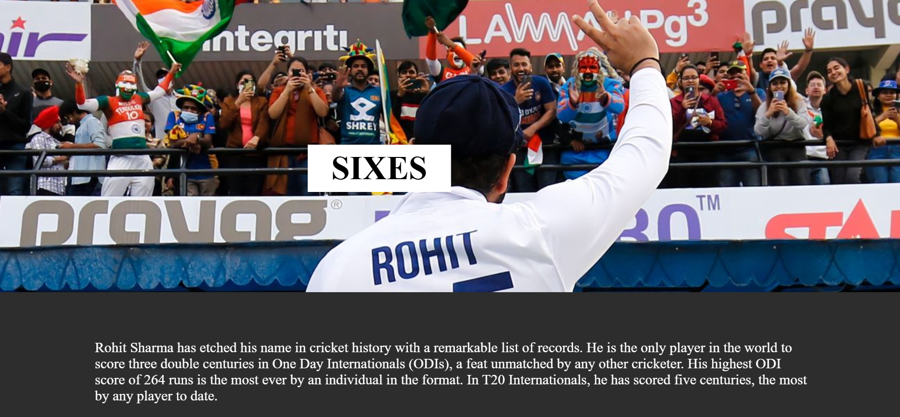

1.🌌 Parallax Effect Website
This project demonstrates a Parallax Scrolling Effect built using only HTML and CSS. The parallax technique creates an illusion of depth by moving background and foreground elements at different speeds while scrolling, 
giving a modern and engaging user experience.

2.🚀 Features

Pure HTML & CSS (no JavaScript required)

Smooth parallax scrolling effect

Responsive layout

Fixed background images with text overlay

Simple and lightweight design

3.📂 Project Structure

Parallax-Effect/
│── index.html        # Main HTML file
│── style.css         # CSS styling
│── images/           # Background images

4.🛠️ Technologies Used

HTML5
CSS3 (flexbox, transforms, object-fit, z-index, perspective)

5.🎯 How It Works

Background and foreground images are layered using position: absolute and transform: translateZ().

The illusion of depth is achieved using CSS perspective.

Section backgrounds use background-attachment: fixed for the parallax effect.

6.📸 Preview
scrrenshot-1

scrrenshot-2

